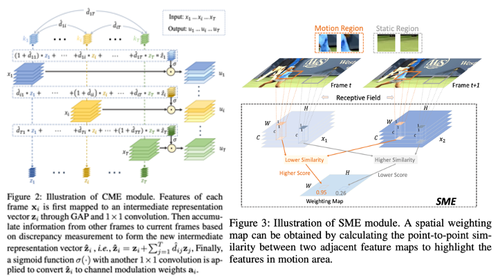

# **Learning Comprehensive Motion Representation for Action Recognition**

## **Overview**

**This is the official PyTorch implement of our CMR model for action recognition, which has been accepted by AAAI2021.**

[**Paper**](https://arxiv.org/abs/2103.12278)

```
@inproceedings{wu2021learning,
  title={Learning Comprehensive Motion Representation for Action Recognition},
  author={Wu, Mingyu and Jiang, Boyuan and Luo, Donghao and Yan, Junchi and Wang, Yabiao and Tai, Ying and Wang, Chengjie and Li, Jilin and Huang, Feiyue and Yang, Xiaokang},
  booktitle={Proceedings of the AAAI conference on artificial intelligence},
  year={2021}
}
```



## **Prerequisites**

**The code is built with following libraries:**

* **PyTorch 1.5**
* **Torch vision 0.5**
* **easydict**
* **numpy**
* **tensorboardX**

## **Data Preparation**

To train and evaluate our model, you should first prepare a meta file, which is divided into 3 columns: video or images path, frame number and category id. **

**An example of videos input as follows:**

```
train_256/water_sliding/28EtkKMIWq0_000018_000028.mp4 300 384
train_256/water_sliding/d0eEGDJ10fU_000000_000010.mp4 300 384
```

**An example of images input as follows:**

```
train_256/water_sliding/28EtkKMIWq0_000018_000028 300 384
train_256/water_sliding/d0eEGDJ10fU_000000_000010 300 384
```

## **Pretrained Models**

For now, we provide the model pretrained on Something-Something V1 and Kinetics 400 datasets for evaluation or fine-tuning on other datasets. To evaluate our model on Something-Something V1 dataset, you should download **[**checkpoint file**](https://drive.google.com/file/d/1zu-8JYP7itjHynfQ4BZzAF_DBLrn0nVN/view?usp=sharing)** to checkpoint folder and download and decompress **[**dataset**](https://20bn.com/datasets/something-something/v1)** to datasets folder. Once done, you can evaluate with the command. We test our model with 8 gpus. You should change ******nproc_per_node****** and ******gpus****** in config file to match your case.

```
python3 -m torch.distributed.launch --nproc_per_node=8 --master_port=34322 x_temporal/main.py --config experiments/CMR/test_sth.yaml
```

## **Train from scratch**

**Once you have prepared the meta file and images, you can easily train model from scratch by yourself with command**

```
python3 -m torch.distributed.launch --nproc_per_node=8 --master_port=34322 x_temporal/main.py --config experiments/CMR/train_sth.yaml --train
```

## **Acknowledgement**

**This codebase is modified from **[**X-Temporal**](https://github.com/Sense-X/X-Temporal)**.**